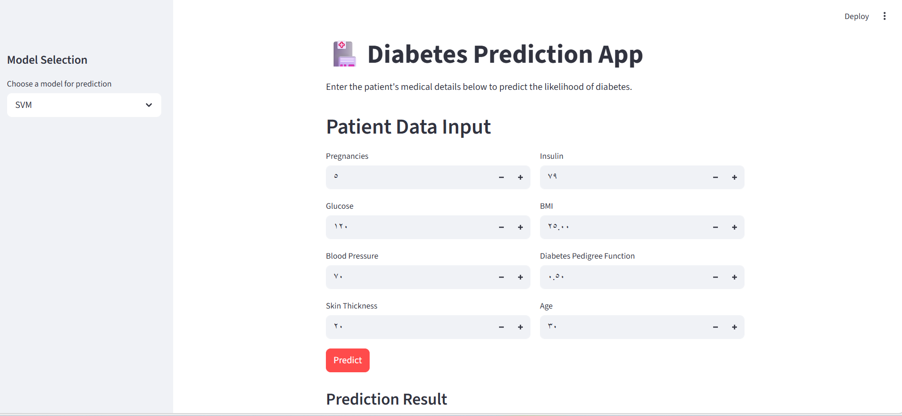

# 🏥 Diabetes Classification Project


## 📖 Overview

The **Diabetes Classification Project** is an end-to-end Machine Learning solution designed to predict the likelihood of diabetes in patients based on specific medical and demographic details. 

This repository contains everything from initial data exploration and preprocessing to training various classification models, and finally serving the best-performing models via a user-friendly **Streamlit** web application.

## 📸 Demo & Quick Look



🎥 **[Watch the full video demonstration here!](https://drive.google.com/file/d/1Yde0jQNz-u_GGyecGoU8czubmT0v1bIE/view?usp=sharing)**

## ✨ Features

- **Exploratory Data Analysis (EDA):** Scripts for data cleaning and understanding feature distributions.
- **Model Training:** Automated training of multiple classifiers including Logistic Regression, Random Forest, and Support Vector Machines (SVM).
- **Interactive Web Application:** A Streamlit-based UI that takes patient inputs and outputs real-time diabetes predictions along with prediction probabilities.
- **Scalable Structure:** Separation of concerns between raw data, experimental notebooks, trained models, and production application code.

## 🛠️ Technology Stack

- **Data Manipulation:** `pandas`, `numpy`
- **Machine Learning:** `scikit-learn`
- **Model Persistence:** `joblib`
- **Web App Framework:** `streamlit`

## 📂 Directory Structure

```text
├── app/
│   └── app.py                     # Streamlit web application source code
├── data/
│   └── diabetes.csv               # Raw dataset
├── models/
│   ├── logistic_regression.pkl    # Trained Logistic Regression model
│   ├── random_forest.pkl          # Trained Random Forest model
│   ├── svm.pkl                    # Trained SVM model
│   └── scaler.pkl                 # Fitted StandardScaler for data normalization
├── notebooks/
│   ├── clean_data.py              # Data cleaning scripts
│   ├── eda_script.py              # Exploratory Data Analysis
│   └── pipeline_and_evaluation.py # Model evaluation & pipeline scripts
├── train_models.py                # Main script to train and save models
├── .gitignore                     # Git ignored files
└── README.md                      # Project documentation
```

## 🚀 Getting Started

### 1. Clone the Repository

```bash
git clone https://github.com/yourusername/diabetes-classification.git
cd diabetes-classification
```

### 2. Install Dependencies

Ensure you have Python 3.8+ installed. Install the required libraries:

```bash
pip install pandas numpy scikit-learn joblib streamlit
```

### 3. Prepare the Data

Make sure your dataset (`diabetes.csv`) is placed inside the `data/` directory.

### 4. Train the Models

Before running the web application, you need to train and save the machine learning models. Execute the training script:

```bash
python train_models.py
```

This will automatically preprocess the data, evaluate the models, and save the trained artifacts (`.pkl` files) into the `models/` directory.

### 5. Run the Web Application

Launch the Streamlit app to interact with the trained models:

```bash
streamlit run app/app.py
```

The application will be accessible in your browser, typically at `http://localhost:8501`. 

## 📊 Dataset Information

**Source:** [Kaggle: Pima Indians Diabetes Database](https://www.kaggle.com/uciml/pima-indians-diabetes-database)

The data contains diagnostic information about patients, such as:
- **Pregnancies**: Number of times pregnant
- **Glucose**: Plasma glucose concentration
- **Blood Pressure**: Diastolic blood pressure (mm Hg)
- **Skin Thickness**: Triceps skin fold thickness (mm)
- **Insulin**: 2-Hour serum insulin (mu U/ml)
- **BMI**: Body mass index (weight in kg/(height in m)^2)
- **Diabetes Pedigree Function**: Diabetes pedigree function
- **Age**: Age (years)
- **Outcome**: Class variable (0 or 1, where 1 means Diabetic)

## 🤝 Contributing

Contributions, issues, and feature requests are welcome! 
Feel free to check out the [issues page](https://github.com/alaamadii/diabetes-classification/issues).

## 📝 License

This project is open-source and available under the [MIT License](LICENSE).

